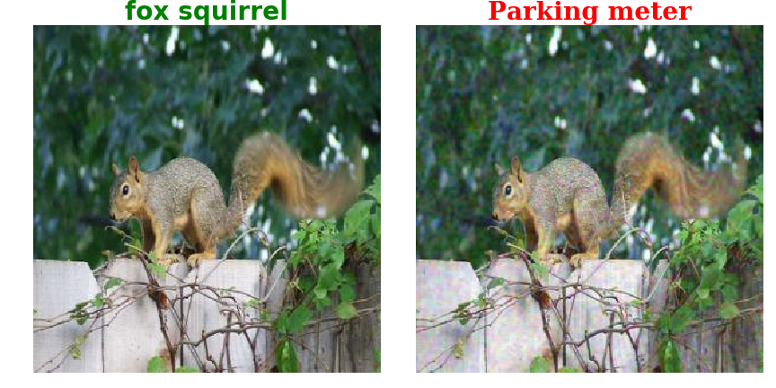

# GenAttack: Practical Black-box Attacks with Gradient-Free Optimization.

This repo has an implemntation for our paper [GenAttack: Practical Black-box Attacks with Gradient-Free Optimization](https://arxiv.org/abs/1805.11090)

## Instructions

### Setup

Install the required libraries:
```
pip install -r requirements.txt
```
### ImageNet Experiment
Download `Inception-v3` model checkpoint

```
python setup_inception.py
```

You can download test images from [ImageNet test set](http://jaina.cs.ucdavis.edu/datasets/adv/imagenet/img.tar.gz).

To run the attack without dimensionality reduction and adaptive parameter scaling
```
 python main.py --input_dir=./images/ --test_size=1 \
    --eps=0.05 --alpha=0.15 --mutation_rate=0.005  \
    --max_steps=500000 --output_dir=attack_outputs  \
    --pop_size=6 --target=704 --adaptive=False
```


**Original class:** Squirrl, **Adversarial class**: Parking Meter, **Number of queries**=74,171


**For more query efficiency**

Run attack with dimensionality reduction and adaptive parameter scaling

```
python main.py --input_dir=./images/ --test_size=1 \
    --eps=0.05 --alpha=0.15 --mutation_rate=0.10  \
    --max_steps=100000 --output_dir=attack_outputs \
    --pop_size=6 --target=704 --adaptive=True --resize_dim=96
```


**Original class:** Squirrl, **Adversarial class**: Parking Meter, **Number of queries**=11,696


**More options**:
* If you want to test on a single image, add the FLAG: `--test_example=xx`.
* To specify a target class, instead of using a random target, add the flag `--target=xx`.

---
### MNIST and CIFAR-10 Experiments

First, you need to train the classification models on MNIST and CIFAR-10 datasets.

```
python train_models.py
```

### Attacking MNIST Model

```
 python main.py --model=mnist --test_size=1000 --mutation_rate=0.30 --alpha=0.5 --adaptive=False --max_steps=10000 --eps=0.30  --output_dir=mnist_output --pop_size=4  --temp=0.1
```

### Attacking CIFAR-10 Model:

```
python main.py --model=cifar10 --test_size=1000 --mutation_rate=0.05 --alpha=0.25 --adaptive=False --max_steps=10000 --eps=0.05  --output_dir=cifar10_output --pop_size=4  --temp=0.1
```

## Maintainer:
* This project is maintained by: Moustafa Alzantot [(malzantot)](https://github.com/malzantot)

